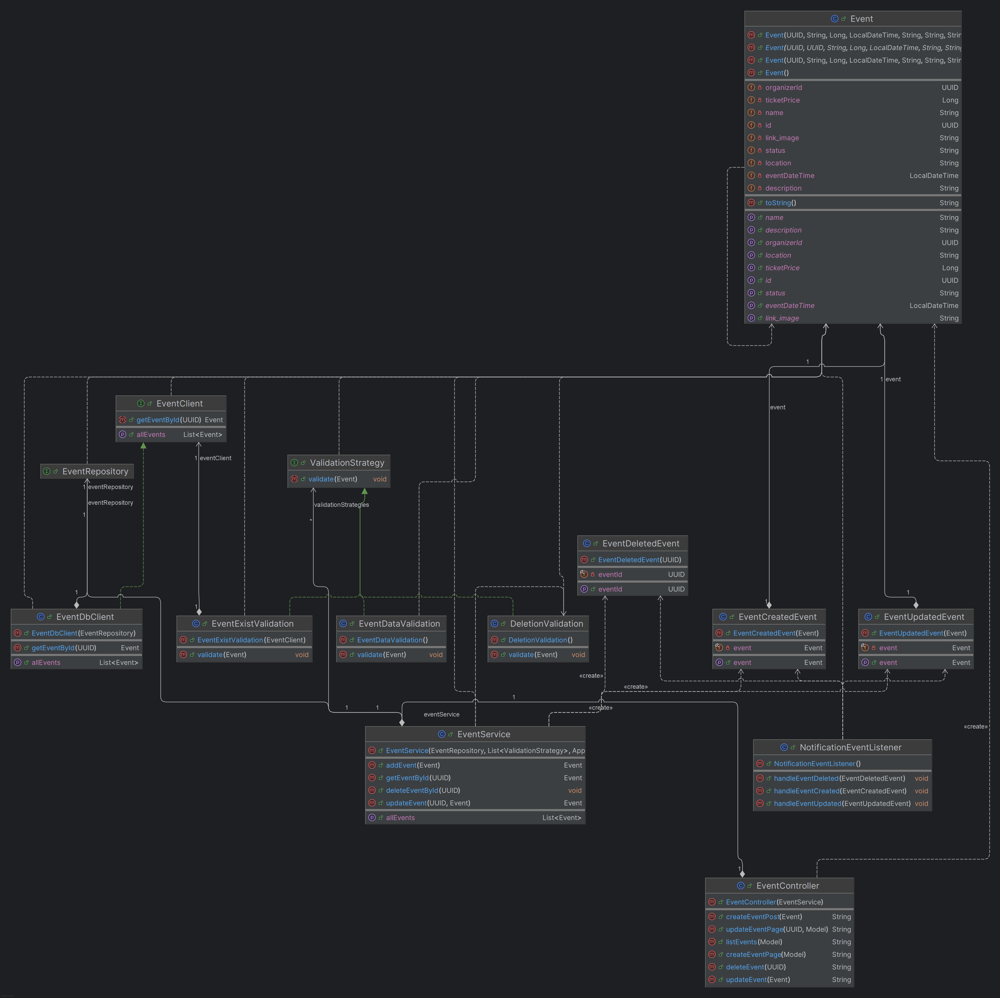
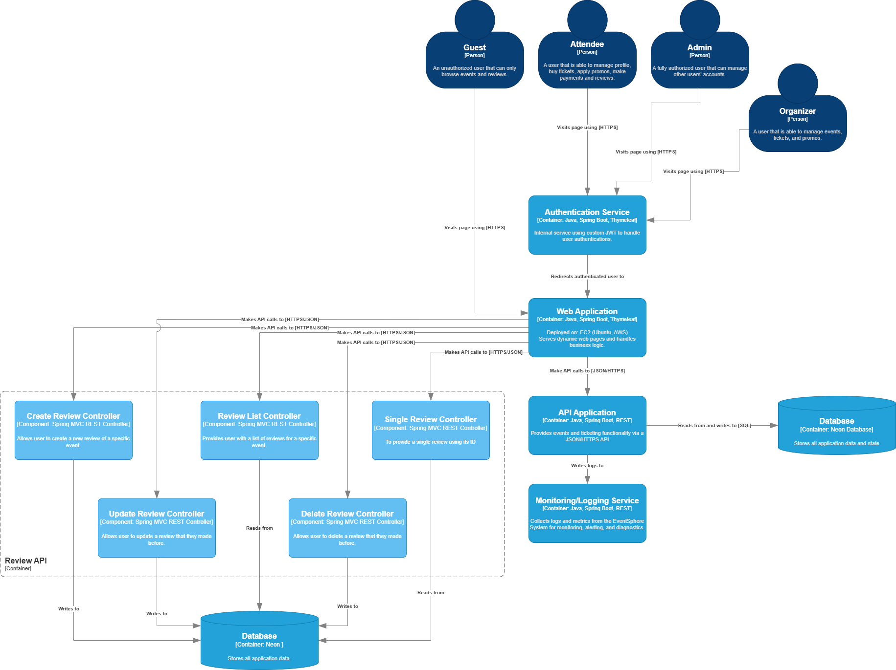
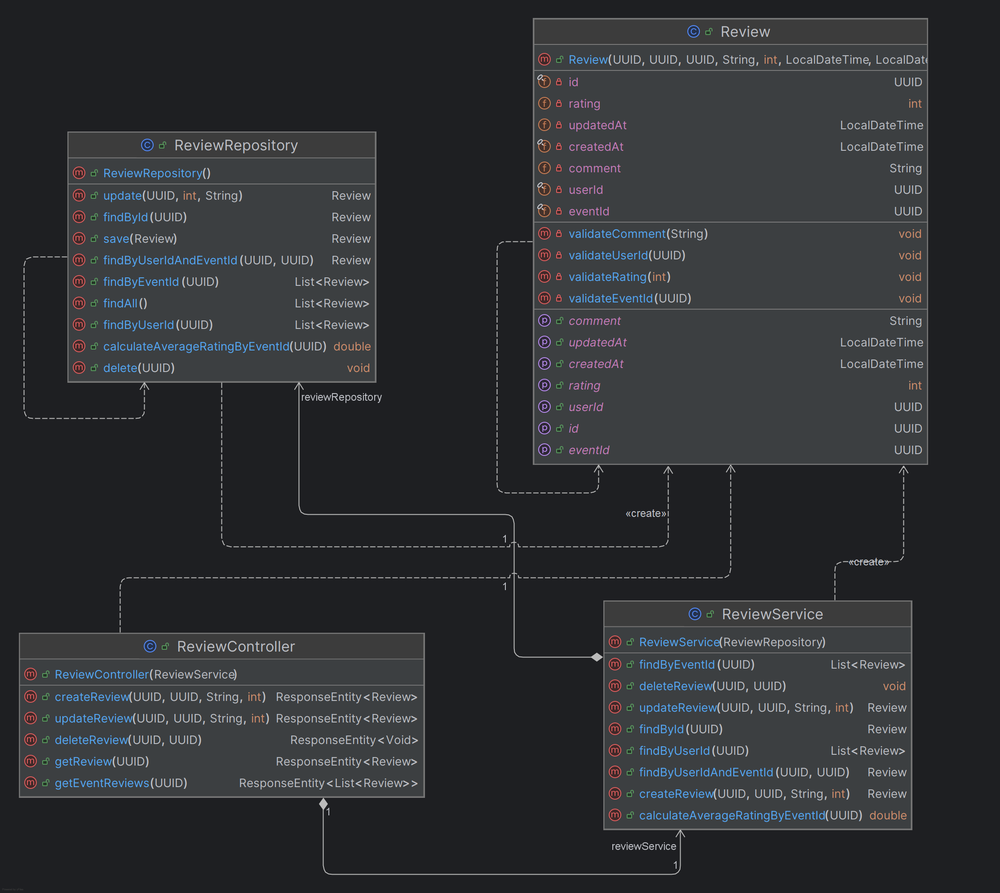
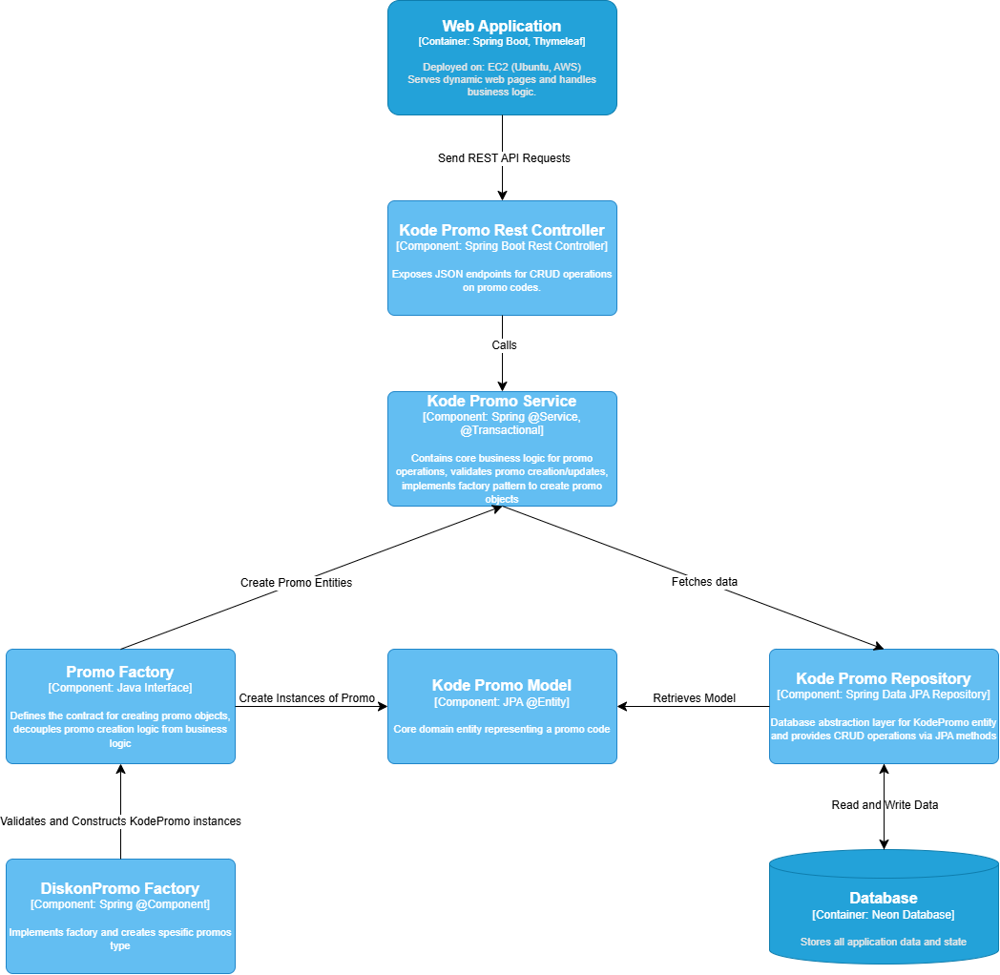

Link deployment: http://ec2-52-86-194-154.compute-1.amazonaws.com:8080/

# Architecture

## Pre-context Diagram

## Pre-container Diagram

## Pre-deployment Diagram

## Post-context Diagram

## Post-container Diagram

## Risk Storming

Kami menerapkan teknik risk storming secara kolaboratif untuk mengidentifikasi dan memprioritaskan risiko utama. Risiko dengan dampak terbesar yang ditemukan adalah terkait celah keamanan akibat ketiadaan autentikasi dan otorisasi, serta rendahnya kemampuan observabilitas tanpa sistem monitoring terpusat. Tanpa mekanisme autentikasi yang kuat, sistem rentan terhadap akses tidak sah, sedangkan tanpa monitoring, tim akan kesulitan mendiagnosis dan merespons insiden secara cepat di lingkungan cloud-native.

Untuk mengatasi risiko ini, kami memutuskan untuk menambahkan modul autentikasi yang memastikan setiap endpoint hanya dapat diakses oleh pengguna sah, serta mengintegrasikan solusi monitoring terpusat pada fase pengembangan selanjutnya. Komitmen terhadap dua aspek ini akan memberikan fondasi keamanan dan keandalan yang lebih baik, sehingga arsitektur backend Eventsphere siap untuk berkembang secara aman dan dapat diobservasi dengan baik seiring peningkatan jumlah pengguna dan kompleksitas aplikasi.

### Event
#### Code

### Ticket
#### Component

#### Code

### Review
#### Component

#### Code

### Promo
#### Component

#### Code
